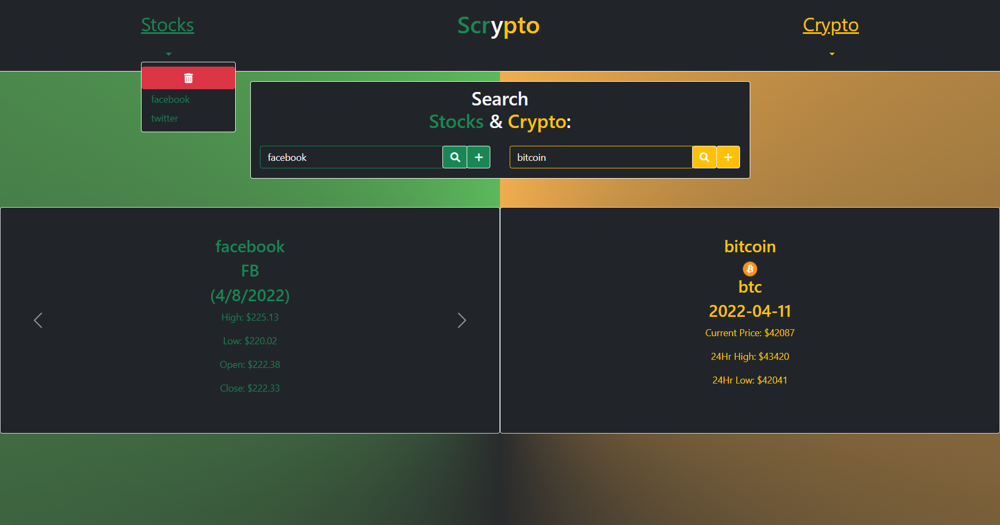

# Group-Project--Scrypto!

## Purpose
Scrypto is a user friendly interface created with javascript, to allow users to search any stock or cryptocurrency they like. When the user inputs the name of a stock or crypto, they will be given the following: 

Searched Stock Will Provide: 
* Symbol of stock, for example, APPLE = 'AAPL'
* Stock price high and low for the past five days
* Stock price opening and closing price for the past five days

Searched Crypto Will Provide:
* Symbol of crypto, for example BITCOIN = 'btc'
* Crypto logo 
* Crypto currrent price for the day
* Crypto highest price reached for the past 24 hours
* Crypto lowest price reached for the past 24 hours

When the user clicks on the plus sign next to the search button, the information typed into the browser will be stored into users favorites list. The favorites tab can be accessed by clicking on the underlined 'Stocks' or 'Crypto' at the top left and right of the page. 

## Built With
*  HTML
* CSS
* JavaScript
* BootStrap
* jQuery
* axios

## Website
https://dawsonf18.github.io/Scrypto/

## Contribution
Made by [Dawson Filion and Gerard Mennella]

## Screenshot

